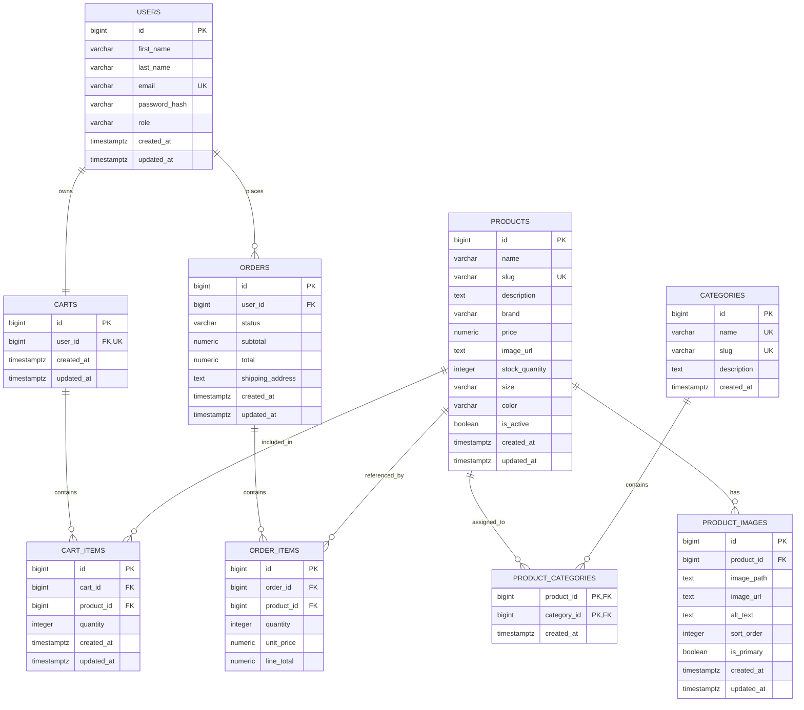

# SoleX Shoes E-Commerce Website

## E-Commerce Sprint 1 Architecture Submission

### Project Purpose

SoleX is a professional online footwear store that enables customers to browse, search, filter, and purchase shoes through a clean web-based shopping experience. The project is scoped as an MVP for an E-Commerce course and is designed with a separated React frontend, Node.js/Express REST backend, and PostgreSQL relational database.

---

## 1. Target Audience & Market Focus

### Target Audience

SoleX is designed for:

- Customers looking for a convenient online shoe-shopping experience.
- Students, young professionals, and everyday shoppers who want to compare footwear before purchasing.
- Mobile and desktop users who expect searchable products, category filtering, cart management, and a straightforward checkout flow.
- Store administrators who need a focused interface for maintaining products, categories, and inventory.

### Market Focus

SoleX focuses on the online footwear retail market, specifically:

- Everyday shoes and lifestyle footwear.
- Searchable product discovery by name and description.
- Category-based browsing such as running, casual, basketball, formal, and outdoor shoes.
- A simple purchasing journey from product discovery to order creation.
- Inventory-aware selling so customers cannot order unavailable stock.

The initial release intentionally focuses on the core retail journey rather than advanced e-commerce services. Payment gateway integration, product reviews, wishlists, coupons, shipping-provider integration, and email notifications are outside the Sprint 1 MVP scope.

### Value Proposition

SoleX provides a focused, maintainable footwear-shopping platform with:

1. A clear product catalog.
2. Fast product search and category filtering.
3. Persistent authenticated shopping carts.
4. Reliable checkout and order processing.
5. Administrative product and inventory management.

---

## 2. MVP Feature Scope Matrix

| Feature | Customer | Admin | REST API | Database Support |
|---|---:|---:|---:|---|
| User registration | Yes | Yes | Yes | `users` |
| User login and logout | Yes | Yes | Yes | `users` |
| JWT authentication | Yes | Yes | Yes | JWT-based; no token table required |
| Password hashing | Not directly visible | Not directly visible | Yes, with bcrypt | `users.password_hash` |
| Browse active products | Yes | Yes | Yes | `products` |
| Search products | Yes | Yes | Yes | `products` |
| Filter by category | Yes | Yes | Yes | `categories`, `product_categories` |
| View product details | Yes | Yes | Yes | `products` |
| Add items to cart | Yes | No | Yes | `carts`, `cart_items` |
| Update cart quantities | Yes | No | Yes | `cart_items` |
| Remove cart items | Yes | No | Yes | `cart_items` |
| Checkout and create order | Yes | No | Yes | `orders`, `order_items` |
| Validate inventory during checkout | No | Yes, indirectly | Yes | `products.stock_quantity` |
| View customer orders | Yes, own orders | Admin, as authorized | Yes | `orders`, `order_items` |
| Create and update products | No | Yes | Yes | `products` |
| Manage categories | No | Yes | Yes | `categories` |
| Manage inventory quantities | No | Yes | Yes | `products.stock_quantity` |
| Manage product images | No | Yes | Yes | `product_images` and file/object storage |

### Explicitly Out of Scope for the MVP

The following features are not part of the initial implementation:

- Real payment gateway integration.
- Guest shopping carts.
- Product reviews and ratings.
- Wishlists.
- Coupons and promotions.
- Shipping-provider integration.
- Tax calculation.
- Email notifications.
- Advanced product-variant management.

For the MVP, each sellable size/color combination may be represented as a product/SKU row. This avoids introducing a separate variant subsystem before it is required.

---

## 3. Tech Stack Selection & Justification

| Area | Selected Technology | Justification |
|---|---|---|
| Frontend | React.js | Component-based UI development supports reusable product, cart, checkout, and admin interfaces. |
| Frontend language | JavaScript | Meets the project requirement and supports the React ecosystem without adding an unapproved language change. |
| Markup | HTML5 | Provides semantic, accessible structure for pages and forms. |
| Styling | CSS3 | Supports responsive layouts and custom visual presentation. |
| Utility styling | Tailwind CSS | Enables consistent, responsive styling with reusable utility classes and efficient iteration. |
| Backend runtime | Node.js | Provides a JavaScript runtime shared with the frontend ecosystem and is suitable for REST services. |
| Backend framework | Express.js | Provides lightweight routing and middleware for authentication, validation, authorization, and error handling. |
| API style | REST API | Clearly separates frontend and backend responsibilities and provides resource-oriented HTTP endpoints. |
| Database | PostgreSQL | Provides a reliable relational database with strong constraints, transactions, foreign keys, and support for normalized e-commerce data. |
| Authentication | JWT | Supports stateless authentication for REST requests. Tokens should be delivered through secure, `HttpOnly` cookies. |
| Password security | bcrypt | Stores one-way password hashes rather than plaintext passwords. |
| Development editor | Visual Studio Code | Provides the project development environment and integrated tooling. |
| Version control | Git | Tracks changes and supports safe collaborative development. |
| Repository hosting | GitHub | Provides remote source control, collaboration, and project history. |

### Architectural Justification

The frontend and backend remain separate so that each layer has a clear responsibility:

- React renders the user interface and calls the REST API.
- Express handles HTTP requests, validation, authentication, business rules, and transactions.
- PostgreSQL persists relational data and enforces integrity.

Only the backend communicates directly with PostgreSQL. Database credentials, JWT secrets, passwords, and API keys must never be exposed to the frontend or committed to the repository. Runtime secrets will be supplied through environment variables; no `.env` file is included in the project.

### Product Image Storage

- Product image files are stored outside PostgreSQL in a dedicated file/object
    storage layer.
- PostgreSQL stores image references and metadata in `product_images`, not
    image binaries.
- The backend owns upload validation, safe filename generation, storage, and
    database persistence.
- Admin users can upload, replace, delete, reorder, and select product images;
    customers cannot manage them.
- Images are associated with products, with multiple images per product and
    one image marked as primary.
- Upload validation must enforce approved image MIME types/extensions and a
    server-side file-size limit.
- Runtime uploads are excluded from Git; only the required empty local storage
    directory marker is tracked.
- The storage adapter must be replaceable with cloud object storage in
    production without changing the database reference model.

For local development, the planned layout is `uploads/products/<product-id>/`.
The planned configuration values are `IMAGE_STORAGE_PATH=uploads` and
`MAX_IMAGE_SIZE_MB=5`. These are architecture requirements, not implemented
runtime settings yet because the backend and authentication layers are still
scaffold-only.

---

## 4. Entity-Relationship Diagram

The database uses primary keys (`PK`) and foreign keys (`FK`) to enforce relational integrity. The `product_categories` junction table implements the many-to-many relationship between products and categories.

### Relationship Explanation

- `Users 1:1 Carts`: each authenticated user has one active cart.
- `Users 1:N Orders`: one user can place many orders.
- `Carts 1:N Cart_Items`: a cart contains one or more cart item records.
- `Products 1:N Cart_Items`: a product can appear in many users' carts.
- `Orders 1:N Order_Items`: an order contains one or more purchased items.
- `Products 1:N Order_Items`: a product can be referenced by many historical order items.
- `Products N:M Categories`: products and categories are connected through `product_categories`.
- `Products 1:N Product_Images`: each product can have multiple ordered images;
    one can be marked as primary.

The order item stores `unit_price` and `line_total` so historical orders remain accurate when the current product price changes. Checkout must validate stock and create the order, order items, inventory updates, and cart clearing within one PostgreSQL transaction.

